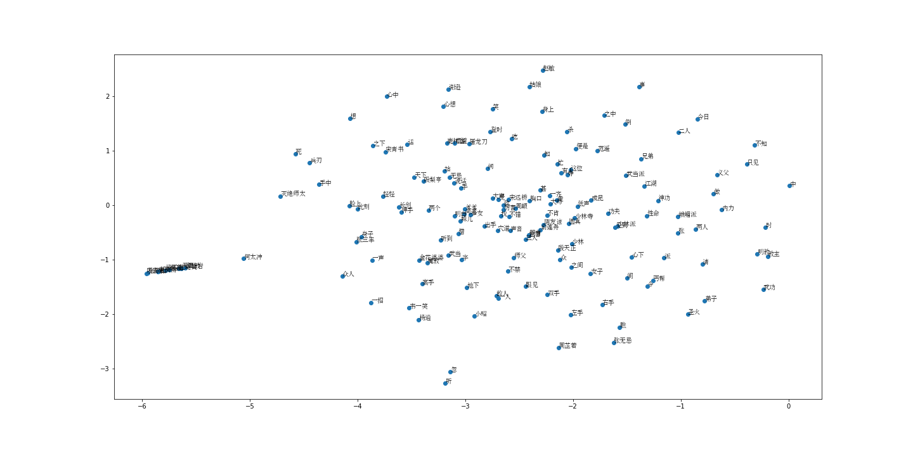

# word2vec
Word2vec implementation based on pytorch.

ref: [word2vec 中的数学](https://spaces.ac.cn/usr/uploads/2017/04/2833204610.pdf)

In order to show all computation details, the model is implemented without inheriting `nn.Module`.

### Example

We need tokenized documents in `list(list(str))` format as dataset, and the result (topk word vectors) will be saved in `vec.npy` as `dict`.

The example is in `src/train.py` . I use novel《倚天屠龙记》as [dataset](https://github.com/wolfkin-hth/novels/tree/master), and lower vector dimensions by t-SNE algorithm to draw the distribution on a 2D plane.



In my model, we can also find the most similar vector of「张无忌」by cosine similarity ，is「周芷若」.

```python
print(get_most_similar('张无忌', word2vec, topk=10))
['周芷若', '赵敏', '心下', '右手', '丐帮', '不禁', '心想', '三人', '瞧', '一齐']
```

